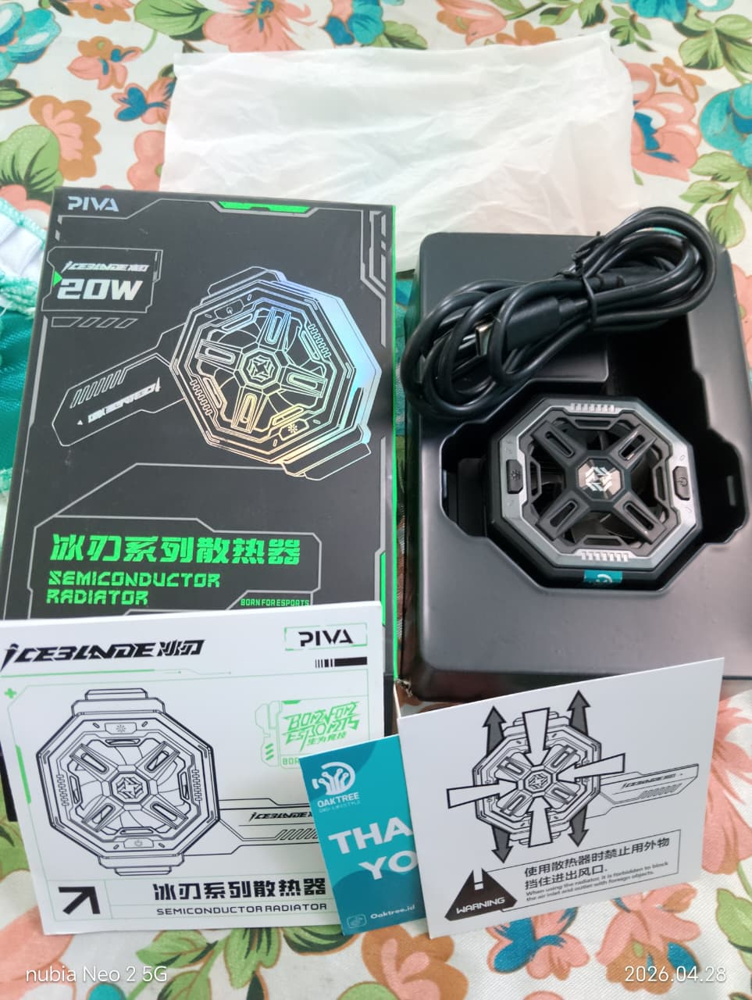

<h1 align="center">𝐅𝐎𝐑 𝐒𝐀𝐋𝐄 💸</h1>

  
  

> **Harga:** Rp500.000 | Nego tipis  
> **Kondisi:** No minus, mulus 99%, like new

---

## 🔥 Fitur Unggulan
- **Overclocking Tech 3 Mode**  
  Normal `9V 2A` / Ultra `12V 2A` / Extreme `12V 2A`
- **Upgraded TEC Peltier**  
  Dingin signifikan & super cepat nurunin suhu HP
- **Noise Reduction Fan**  
  Kipas tambahan buat buang hawa panas maksimal
- **Special Shaped Cooling Surface**  
  Area pad pendingin lebih luas, ngecover sampai samping kamera
- **RGB Lighting**  
  Tombol khusus untuk mematikan lampu RGB  
- **Tombol Power**  
  Untuk On/Off dan ganti mode pendinginan
- **Super Compatibility**  
  Buat HP lebar `69-92mm`, maks `9cm`, lebar samping kamera minimal `20mm`. iPhone/Android gas

## 📋 Spesifikasi
| Item | Detail |
| --- | --- |
| **Model** | PIVA BL7 Semiconductor Radiator |
| **Bahan** | ABS |
| **Port** | Type-C |
| **Wajib** | Pake charger min 20W biar suhu maksimal. Jangan tutup lubang udara |

## 📦 Kelengkapan: FULLSET
- Unit Radiator PIVA BL7
- Kabel Type-C to C 1.5m original
- Box PIVA BL7
- Kartu Quality Control + Manual

## ✅ Kondisi Barang
No minus, no lecet, no dent. Fungsi 100% normal, 3 mode jalan semua, RGB nyala.  
Pemakaian pribadi.  
**Alasan jual:** Udah ga ngegame.

---

  
<b>👤 CONTACT ADMIN</b>

   
  
  **IG:** <a href="https://www.instagram.com/stars_fov?igsh=MXFpem8wcjFxZGF6aQ==">Dm Instagram</a>  
  **TT:** <a href="https://www.tiktok.com/@alfhjdn?_r=1&_t=ZS-95uGmBd1An6">Dm TikTok</a>   
  **WA:** <a href="https://wa.me/62882009645268">Chat WhatsApp</a>

**Lokasi:** Lumajang, Jawa Timur    

